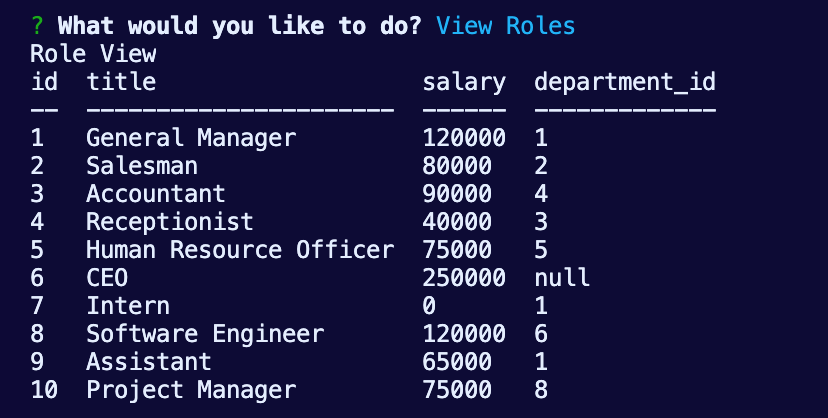

# Employee Tracker


## Description

Employee Tracker application is an organization method to view, employees, departments, and roles. The user may also, add a department, add an employee, or add a role. The may also update an employee.

## User Story

```md
AS A business owner
I WANT to be able to view and manage the departments, roles, and employees in my company
SO THAT I can organize and plan my business
```

## Installation

```md
The application requires NPM and mySQL. The databases and seeds are ran in Sequal Pro. Sequel Pro is the GUI utlized to run the schema and seeds. The information populated in the terminal can also be seen in Sequel Pro, however this is an optional step.
```

## DEMO

The following video shows an example of the application being used from the command line:


## Getting Started with views

The user will be prompted with a series of questions. If the user selected View Employees. They will be presented with a list of all employees

The employees table will have a column for ID, First name, Last name, and Manager ID


The user will be prompted with a series of questions. If the user selects View Department. They will be presented with a list of all existing departments

The department table will have a column for ID and department name 


The user will be prompted with a series of questions. If the user selects View Roles. They will be presented with a list of all existing roles.

The department table will have a column for ID, title, salary, and department ID 


## Getting Started with adding
The user will be prompted with a series of questions. If the user selects add Employee. They will be presented with a list of questions and will be prompted with a message if the employee has been successfully added.

The user will be asked to enter the employee's first name, last name, role ID and Manager's ID. Once the employee has been created they will be added to the database. In the terminal the user will be presented with a message stating the employee has been added, however if one is using a GUI the added data will also appear in the table to which the employee was created. In this case it will be the employee table. This screenshot is from Sequel Pro (again this GUI is optional). In this example Chip Potato was added with an ID of 15, role ID 1 and manager ID 2 . 


The user will be prompted with a series of questions. If the user selects add Department. They will be presented with a question and will be prompted with a message if the department has been successfully added.

The user will be asked to enter the the name of the new department . In this example we added the Sales Trainer was added with an ID of 9 


The user will be prompted with a series of questions. If the user selects add Roles. They will be presented with a list of questions and will be prompted with a message if the role has been successfully added.

The user will be asked to enter the role name, role salary, department ID this role is associated with. Once the role has been created they will be added to the databases. In the terminal the user will be presented with a message stating the role has been added. In this example our lead trainer role was added with an ID of 11 salary of 40000 and the associated department ID (2 for sales)


The user will be prompted with a series of questions. If the user selects update employee. They will be presented with a list of questions and will be prompted with a message if the role has been successfully updated.

The user will be asked to select the employee they would like to update . The user will be asked to select the role of the employee. Once completed they will be advised  role was successully update. In our example with Chip Potato when he was added his role was role ID 1. Now Chip Potato was updated to the intern role, which changed Chip's role ID from 1 to role ID 7 (the role ID associated with the role of intern)


## License
MIT License

Copyright (c) 2021 Dlelias

Permission is hereby granted, free of charge, to any person obtaining a copy of this software and associated documentation files (the "Software"), to deal in the Software without restriction, including without limitation the rights to use, copy, modify, merge, publish, distribute, sublicense, and/or sell copies of the Software, and to permit persons to whom the Software is furnished to do so, subject to the following conditions:

The above copyright notice and this permission notice shall be included in all copies or substantial portions of the Software.

THE SOFTWARE IS PROVIDED "AS IS", WITHOUT WARRANTY OF ANY KIND, EXPRESS OR IMPLIED, INCLUDING BUT NOT LIMITED TO THE WARRANTIES OF MERCHANTABILITY, FITNESS FOR A PARTICULAR PURPOSE AND NONINFRINGEMENT. IN NO EVENT SHALL THE AUTHORS OR COPYRIGHT HOLDERS BE LIABLE FOR ANY CLAIM, DAMAGES OR OTHER LIABILITY, WHETHER IN AN ACTION OF CONTRACT, TORT OR OTHERWISE, ARISING FROM, OUT OF OR IN CONNECTION WITH THE SOFTWARE OR THE USE OR OTHER DEALINGS IN THE SOFTWARE.


